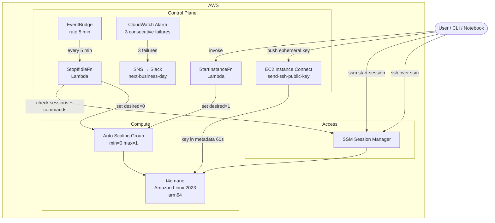
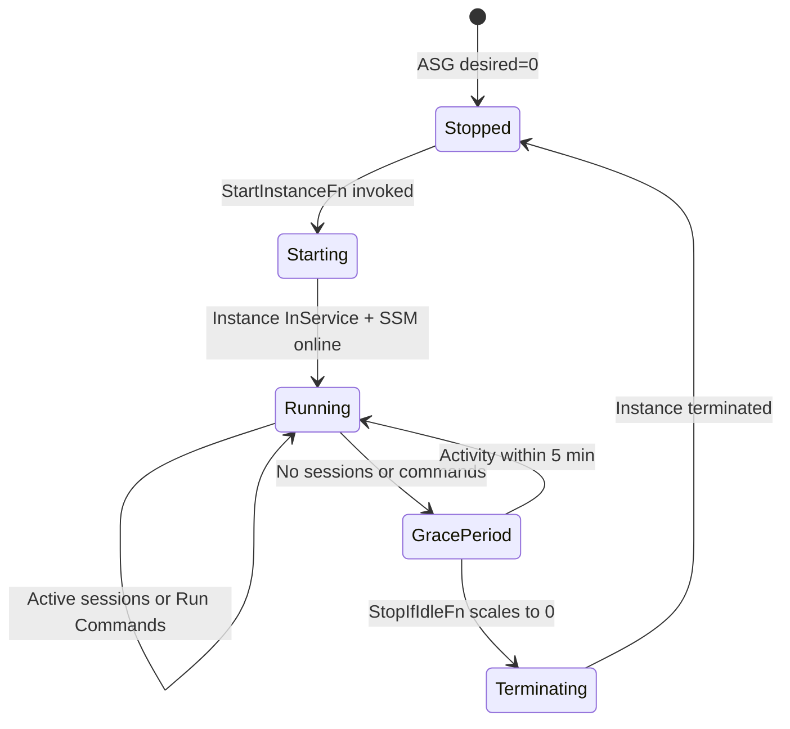
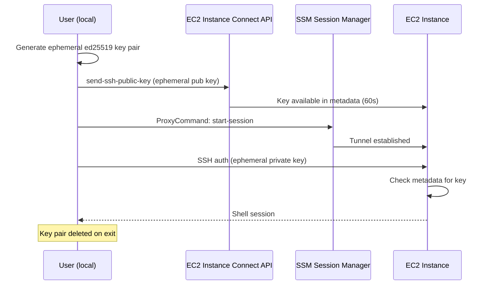
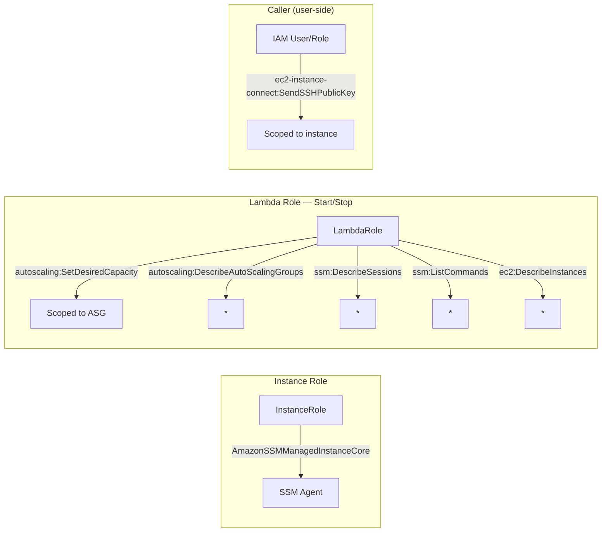

# Design: On-Demand EC2 via Auto Scaling Group

## Problem

Running a persistent EC2 instance 24/7 for occasional use
(dev work, testing, builds) wastes money. You need an instance
available on demand, but you don't want to pay for it when it's
idle. Manual start/stop is error-prone — you forget to shut it
down, and it runs all weekend.

## Solution

An ephemeral Graviton instance managed by an Auto Scaling Group
(min=0, max=1) that:

1. Starts on demand via a Lambda function
2. Automatically terminates after 5 minutes of no active SSM
   sessions or Run Commands
3. Supports both SSM Session Manager and SSH-over-SSM access
4. Uses EC2 Instance Connect for ephemeral SSH key management
5. Alerts via SNS → Slack if the idle checker fails

The entire infrastructure is a single CloudFormation template
with no external dependencies.

## Architecture

### High-Level Overview

### Instance Lifecycle

### SSH via EC2 Instance Connect

## Key Design Decisions

### Why ASG instead of direct EC2 start/stop?

- ASG handles instance replacement if it becomes unhealthy
- Scaling to 0 terminates completely — no EBS charges
- The instance is truly ephemeral: fresh AMI, fresh user data
- No state to manage or drift to worry about
- Every launch picks up the latest Amazon Linux 2023 AMI via
  the SSM public parameter, so the instance is always fully
  patched — no in-place OS updates or patch management

### Why SSM Session Manager as the primary access?

- No SSH keys, security groups, or public IPs needed
- No inbound ports open — outbound connection only
- Session activity is auditable via CloudTrail
- The idle checker detects active sessions to prevent
  premature shutdown

### Why SSH over SSM in addition to plain SSM?

- Port forwarding (access services on the instance)
- SCP/SFTP file transfer
- SSH agent forwarding
- Editor integration (VS Code Remote SSH, etc.)
- SSM sessions still count for idle detection

### Why EC2 Instance Connect for SSH keys?

- No keys stored in AWS — nothing to rotate, leak, or
  clean up
- Each user uses their own local key pair — no shared
  secrets
- Keys are ephemeral (60 seconds in instance metadata) —
  minimal attack window
- Pre-installed on AL2023 standard AMI — no user data
  setup needed
- Eliminates 4 CloudFormation resources (rotation Lambda,
  IAM role, EventBridge rule, permission)

## Components

### CloudFormation Resources

| Resource                 | Type               | Purpose                         |
| ------------------------ | ------------------ | ------------------------------- |
| `InstanceRole`           | IAM Role           | SSM core                        |
| `InstanceProfile`        | Instance Profile   | Attaches role to EC2            |
| `SecurityGroup`          | Security Group     | No ingress — SSM only           |
| `LaunchTemplate`         | Launch Template    | Instance config + user data     |
| `ASG`                    | Auto Scaling Group | Manages 0 or 1 instances        |
| `LambdaRole`             | IAM Role           | ASG control + SSM queries       |
| `StartInstanceFn`        | Lambda             | Sets desired capacity to 1      |
| `StopIfIdleFn`           | Lambda             | Checks idle, scales to 0        |
| `IdleCheckSchedule`      | EventBridge Rule   | Triggers idle check (5 min)     |
| `IdleCheckPermission`    | Lambda Permission  | EventBridge → Lambda            |
| `IdleCheckErrorAlarm`    | CloudWatch Alarm   | 3 failures → SNS alert          |

### Scripts (`scripts/`)

| Script                       | Purpose                                     |
| ---------------------------- | ------------------------------------------- |
| `common.sh`                  | Shared helpers (stack outputs, instance ID) |
| `ensure-ec2-running.sh`      | Start + wait for SSM (5 min timeout)        |
| `interactive-ssm-session.sh` | Interactive SSM shell                       |
| `interactive-ssh-session.sh` | Interactive SSH shell over SSM              |
| `test-ssm-run-command.sh`    | Run command via SSM                         |
| `test-ssh-run-command.sh`    | Run command via SSH over SSM                |
| `resolve-bastion-source-sg.sh` | Resolve bastion source SG from SSM (warns if missing) |
| `status.sh`                  | Full system status snapshot                 |
| `lint.sh`                    | cfn-lint + shellcheck + checkmake + rumdl   |
| `load_config.py`             | Parse YAML config into Make variables       |
| `chooser.py`                 | Interactive Textual TUI environment picker  |
| `environments.json`          | Environment list for single-env choosers    |
| `environments-with-both.json`| Environment list with "both" option         |

### Notebook (`notebooks/`)

| File               | Purpose                          |
| ------------------ | -------------------------------- |
| `ssm_on_demand.py` | Marimo UI — start, run, connect  |

## IAM Permission Model

Notable IAM constraints discovered during implementation:

- `autoscaling:DescribeAutoScalingGroups` does not support
  resource-level permissions — requires `Resource: '*'`

## Resource Tagging

All resources are tagged via `--tags` on `aws cloudformation deploy`:

| Tag           | Value                    |
| ------------- | ------------------------ |
| `Project`     | `on-demand-ec2`          |
| `Environment` | from config (`prod` etc) |
| `Owner`       | from config              |

Stack-level tags propagate to all supported resources automatically.

## Code Quality

- **cfn-lint** validates the CloudFormation template
- **ShellCheck** validates all shell scripts
- **rumdl** enforces markdown formatting (120-char line width)
- **Pre-commit hooks** run on every commit: trailing whitespace,
  end-of-file fixer, YAML check, large file check, merge conflict
  check, private key detection, cfn-lint, shellcheck
- Run `make lint` for all checks, or install hooks with
  `pre-commit install`

## Cost

| Component                 | Cost                   |
| ------------------------- | ---------------------- |
| Instance off              | ~$0 (Lambda free tier) |
| Instance on               | ~$0.0042/hr (t4g.nano) |
| Lambda                    | Free tier              |
| EventBridge               | Free                   |
| CloudWatch Alarm          | Free (first 10 alarms) |

Running 8 hrs/day, 5 days/week ≈ $0.70/month.

## Security Considerations

- No inbound security group rules — zero network attack surface
- No SSH keys stored in AWS — EC2 Instance Connect pushes
  ephemeral keys valid for 60 seconds
- Each user authenticates with their own local key pair
- Instance role follows least privilege — SSM core only
- All access auditable via CloudTrail (SSM sessions, Lambda
  invocations, EC2 Instance Connect calls)
- Instance is ephemeral — no persistent state, fresh patched
  AMI on every boot
- `detect-private-key` pre-commit hook prevents accidental
  commits of key material
- CloudWatch alarm alerts on idle checker failures to prevent
  silent cost overruns

## Bastion Source Security Group

The instance optionally attaches a second "source" security
group from `platform/bastion-source-sg/`. This group has no
rules — it's a marker that identifies the instance as a bastion.
RDS and other backend resources allow ingress from this group ID.

The group ID is resolved from SSM at
`/{env}/network/bastion-source-security-group-id` during deploy.
If the parameter or the security group doesn't exist, the deploy
warns and continues without it. See
[ADR 014](adr/014-bastion-source-security-group.md).
