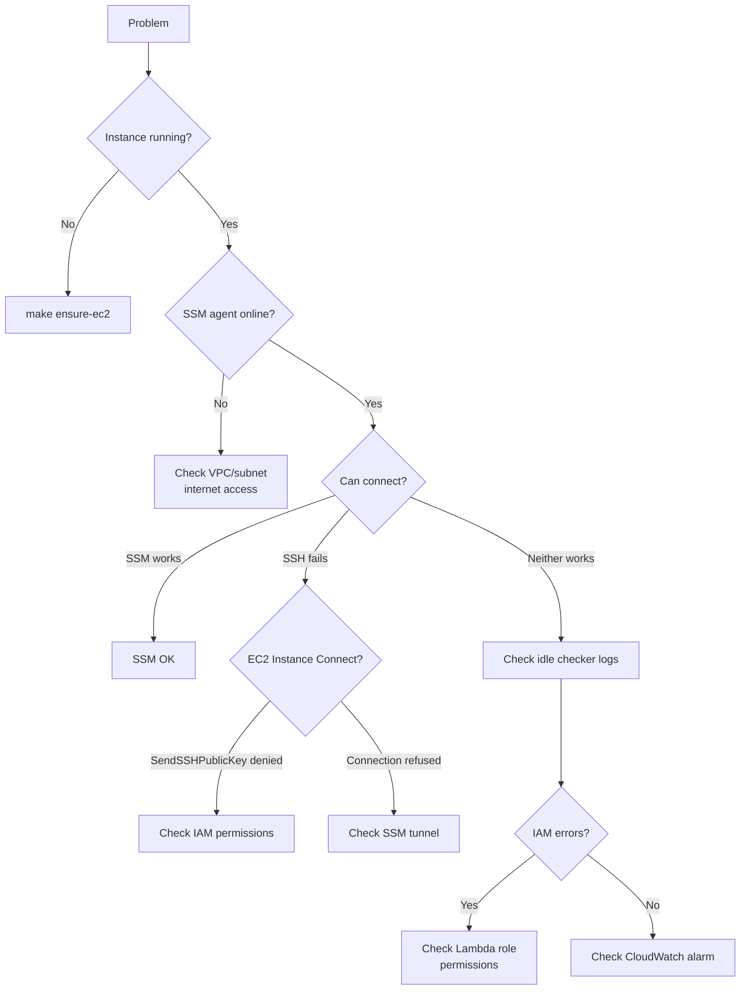

# Troubleshooting

Quick status snapshot: `make status`

## Debugging flow



## Check instance status

```bash
aws ec2 describe-instances \
  --filters Name=instance-state-name,Values=running \
  --query "Reservations[*].Instances[*].\
[InstanceId,State.Name,InstanceType,LaunchTime]" \
  --output table
```

## Check active SSM sessions

```bash
aws ssm describe-sessions --state Active
```

## Check active Run Commands

```bash
aws ssm list-commands --filters key=Status,value=InProgress
```

The idle checker keeps the instance alive if there are active SSM
sessions OR in-progress Run Commands.

## Check the idle checker is firing

```bash
aws events list-rules \
  --query "Rules[?contains(Name, 'ssm-on-demand')].\
[Name,State,ScheduleExpression]" \
  --output table
```

## Check idle checker logs

```bash
# Find the log group
aws logs describe-log-groups \
  --log-group-name-prefix \
  /aws/lambda/ssm-on-demand-StopIfIdleFn

# Get the latest log stream
LOG_STREAM=$(aws logs describe-log-streams \
  --log-group-name \
  /aws/lambda/ssm-on-demand-StopIfIdleFn-XXXX \
  --order-by LastEventTime --descending --limit 1 \
  --query "logStreams[0].logStreamName" --output text)

# Read the logs
aws logs get-log-events \
  --log-group-name \
  /aws/lambda/ssm-on-demand-StopIfIdleFn-XXXX \
  --log-stream-name "$LOG_STREAM" \
  --limit 50
```

## CloudWatch alarm

The stack includes a CloudWatch alarm (`IdleCheckErrorAlarm`)
that triggers if the idle checker Lambda fails 3 times in a row.
Notifications go to the configured SNS topic if one is set.

```bash
aws cloudwatch describe-alarms \
  --alarm-name-prefix ssm-on-demand
```

## Common issues

### Instance never shuts down

Check the Lambda logs for IAM permission errors.
`autoscaling:DescribeAutoScalingGroups` requires
`Resource: '*'` — it doesn't support resource-level permissions.

### Instance not starting

Check the `StartInstanceFn` logs the same way, substituting
the function name.

### SSM can't connect

The instance needs either internet access (public subnet + IGW)
or VPC endpoints for SSM (`ssm`, `ssmmessages`, `ec2messages`).

### SSH permission denied

SSH uses EC2 Instance Connect — an ephemeral key pair is
generated per connection and pushed via the
`send-ssh-public-key` API. The key is valid for 60 seconds.

If you get "Permission denied":

- Check your IAM identity has
  `ec2-instance-connect:SendSSHPublicKey` permission
- Ensure the instance is running AL2023 standard AMI (EC2
  Instance Connect is pre-installed)
- Verify the instance can reach IMDS (should always work
  unless metadata is disabled)

```bash
# Test manually
INSTANCE_ID=i-xxx
AZ=ap-southeast-2a
ssh-keygen -t ed25519 -f /tmp/test_key -N ""
aws ec2-instance-connect send-ssh-public-key \
  --instance-id "$INSTANCE_ID" \
  --instance-os-user ec2-user \
  --availability-zone "$AZ" \
  --ssh-public-key file:///tmp/test_key.pub
```
